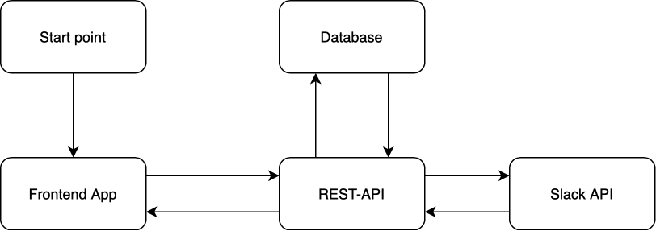

<h1>NodeJS NEST API</h1>

<h2>Basic Structure</h2>


<h2>General Flow</h2>


<h2>How to launch Application</h2>

- Add SSH key from GitHub.
- Install NVM(Node Version Manager) with nodeJS v14.18.2
- Install dependencies with npm
- Install Docker (if using docker for postgres database)
- Add .env file to App root directory and setup credentials

```
   PORT=
   HOST=

   DATABASE_HOST=
   DATABASE_PORT=
   API_KEY=
   SALT=
   SLACK_CLIENT_ID=
   SLACK_CLIENT_SECRET=
   SLACK_SIGNING_SECRET=
   SLACK_ACCESS_TOKEN=
   SLACK_USER_ACCESS_TOKEN=
   FRONTEND_URI=
   SENDGRID_API_KEY=

   SMTP_HOST=smtp.sendgrid.net
   SMTP_PORT=587
   SMTP_SECURE=true
   SMTP_AUTH_USER=apikey
   SMTP_AUTH_PASS=
```